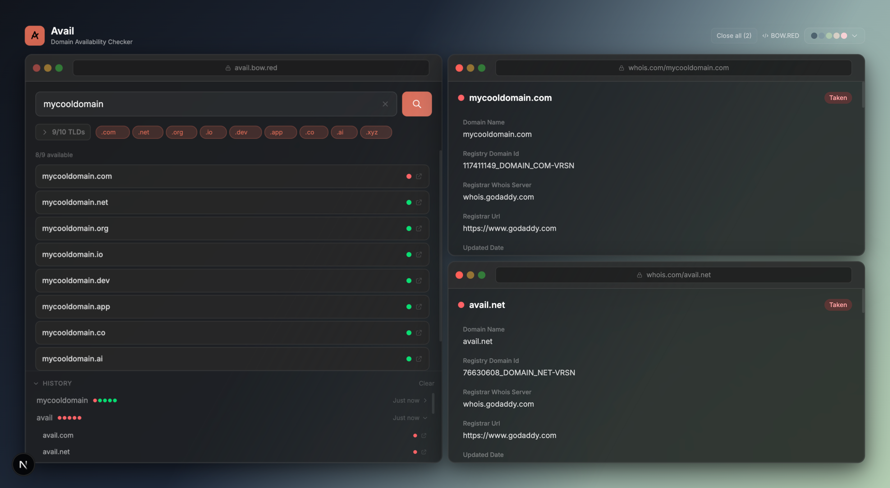
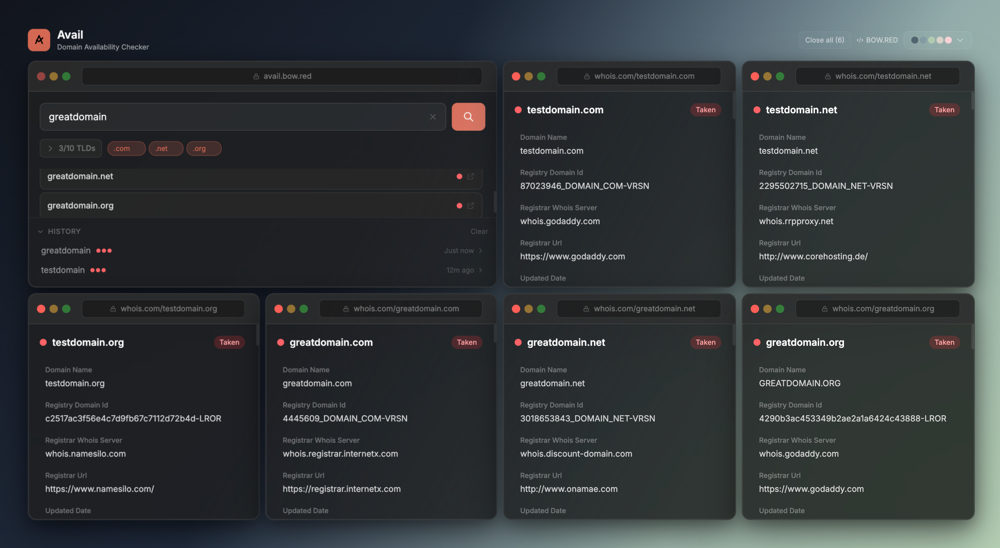

<div align="center">


**A modern interface for live WHOIS & RDAP lookups.**

Check domain availability across 1000+ TLDs with real-time WHOIS and RDAP lookups.  
Built for developers, domain investors, and branding experts.

<br />

[**Explore Docs**](docs/README.md) · [**Report Bug**](https://github.com/kevintr303/avail/issues/new) · [**Request Feature**](https://github.com/kevintr303/avail/issues/new)

</div>

## Interface Preview

<div align="center">
  
</div>

<br />

## Overview

**Avail** is a domain availability checker designed to streamline domain research and branding workflows. It provides an efficient interface for checking domain availability across multiple top-level domains while delivering raw WHOIS and RDAP registration data through an intuitive, responsive UI.

## Architecture & Privacy

Avail performs **live WHOIS and RDAP lookups only**.

- No domain searches are stored
- No WHOIS results are cached
- No user data is collected
- All history and preferences are stored locally in the browser

Avail is intentionally designed as a **stateless, read-only inspection tool**. Avail does not provide registration, pricing, valuation, or registrar integrations by design.

## Quick Demo

<p align="center" width="100%">
<video src="https://github.com/user-attachments/assets/5c3bcb5c-2008-4658-88e1-b64d07c388c8" width="80%" controls></video>
</p>

## Key Features

- **Multi-TLD Support** — Query domain availability across 1,000+ TLDs simultaneously
- **Real-Time WHOIS Data** — Access registration dates, registrar information, nameservers, and registry details instantly
- **Batch Domain Search** — Check multiple domain extensions in a single search operation
- **Workspace-Style Interface** — Multi-panel WHOIS inspection with side-by-side views, built-in themes, and a layout optimized for comparison and long-running research sessions
- **Type-Safe Architecture** — Built with TypeScript for enhanced reliability and developer experience
- **Mobile Navigation** — On smaller screens, active inspection views are presented as swipeable pages with a paged indicator for quick navigation

### Workspace-Style WHOIS Inspection

Avail supports multi-panel WHOIS inspection, allowing multiple domains and TLDs to be viewed side-by-side for comparison during research sessions.

<div align="center">
  
</div>

## Technology Stack

- **Framework:** [Next.js 16](https://nextjs.org/) (App Router)
- **Language:** [TypeScript 5](https://www.typescriptlang.org/)
- **UI Library:** [React 19](https://react.dev/)
- **Styling:** [Tailwind CSS 4](https://tailwindcss.com/)
- **Components:** [Radix UI](https://www.radix-ui.com/) (Tabs, Select, Scroll Area, Slot)
- **Icons:** [Lucide React](https://lucide.dev/)
- **Domain Lookup:** [whois-json](https://www.npmjs.com/package/whois-json)
- **Utilities:** clsx, class-variance-authority, tailwind-merge

## Installation

### Prerequisites

- Node.js 18.x or higher
- npm, yarn, or pnpm package manager

### Setup

1. Clone the repository:

   ```bash
   git clone https://github.com/kevintr303/avail.git
   cd avail
   ```

2. Install dependencies:

   ```bash
   npm install
   ```

3. Start the development server:

   ```bash
   npm run dev
   ```

4. Open [http://localhost:3000](http://localhost:3000) in your browser.

### Available Scripts

- `npm run dev` — Start development server
- `npm run build` — Build for production
- `npm start` — Start production server
- `npm run lint` — Run ESLint

## Usage

1. Enter a domain name in the search field
2. Select specific TLDs or search across all available extensions
3. View availability status and detailed WHOIS information for each domain
4. Click on any domain to access comprehensive registration details

## License

This project is licensed under the **GNU Affero General Public License v3.0**.  
See the [LICENSE](LICENSE) file for details.

---

<div align="center">

**Built by [Bow Dot Red](https://bow.red)**

</div>
